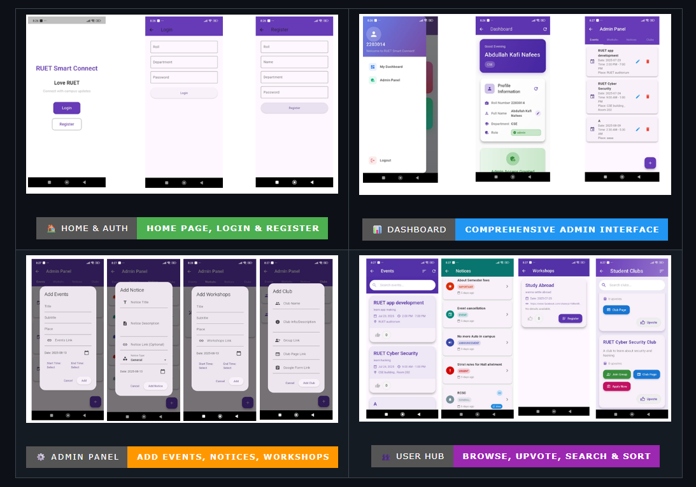

# kafi-portfolio
# 🚀 Modern Personal Portfolio | RCS Hackathon 2026

A sleek, responsive personal portfolio built for the **RCS Internal Hackathon 2026**. This site showcases my journey as a CSE student, my projects, and my contributions to the tech community.

## 📸 Preview
 
*(Note: You can add a full-page screenshot in the assets folder and link it here)*

## ✨ Key Features
* **Modern UI/UX**: Built with Tailwind CSS featuring a glassmorphism aesthetic and dark mode.
* **Dynamic Animations**: Smooth scroll and reveal effects using the AOS (Animate On Scroll) library.
* **Interactive Elements**: Real-time stats counter for problem-solving and social connections.
* **Responsive Design**: Fully optimized for mobile, tablet, and desktop views.

## 🛠️ Tech Stack
* **Frontend**: HTML5, Tailwind CSS.
* **Interactions**: JavaScript (AOS Library, FontAwesome).
* **Deployment**: Hosted via GitHub Pages.

## 📂 Project Structure
* `index.html`: Main structure and styling.
* `assets/`: Contains images, icons, and professional documents like CV.
* `README.md`: Project documentation.

## 👤 About Me
I am a Computer Science & Engineering student at **RUET (Batch '22)**. I specialize in Flutter app development and have a keen interest in Cybersecurity.
